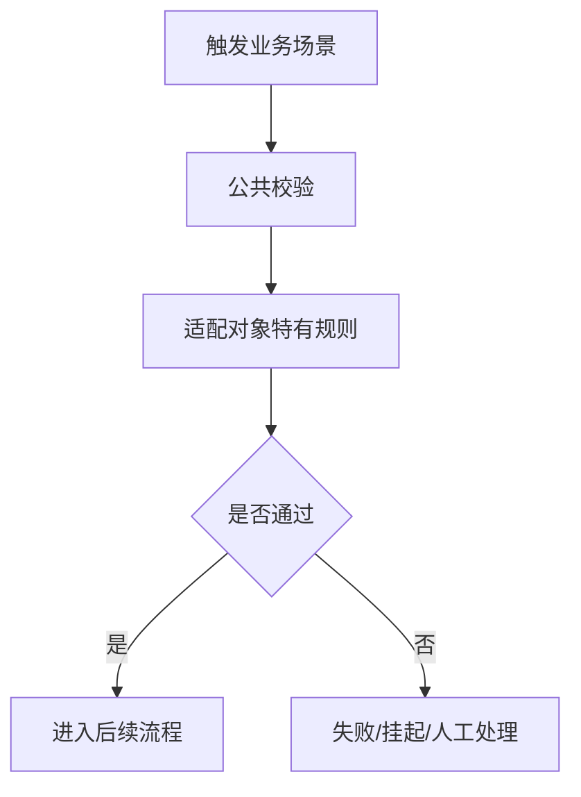
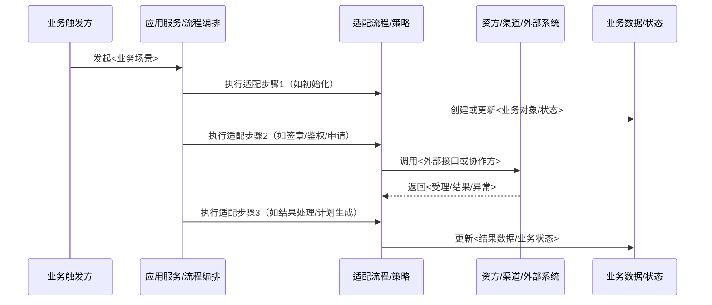
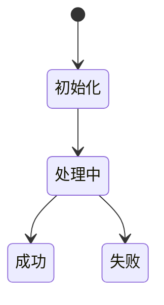

# <适配对象>-<场景中文名>业务适配说明

> 文档层级：业务适配详解
> 所属领域：<领域中文名>（<domain-slug>）
> 适配编号：BA-xxx
> 适配对象：<资方/渠道/产品/策略/审批流>
> 文档状态：初稿 | 已评审 | 待补充
> 更新日期：YYYY-MM-DD

## 1. 适配对象与适用范围

- 适配对象：
- 适用业务能力：
- 适用产品/渠道/租户/配置：
- 入口场景：
- 不适用范围：
- 可信度说明：

## 2. 业务流程

图示状态：已根据事实补全 | 部分待确认 | 不适用，原因：

## 3. 适配时序图

> 用于表达该适配对象相对公共流程新增、删除、重排或特殊处理的具体步骤。步骤名称必须来自源码、配置、接口文档、正式文档或用户确认，不得为了补图臆造。

图示状态：已根据事实补全 | 部分待确认 | 不适用，原因：

| 顺序 | 适配步骤 | 公共/特有 | 触发条件 | 协作对象 | 状态/数据影响 | 证据 |
| --- | --- | --- | --- | --- | --- | --- |
| 1 | <步骤名称> | 公共/特有 | <条件> | <系统/组件/角色> | <影响> | <path/用户确认> |

## 4. 关键业务规则

| 规则编号 | 规则内容 | 触发条件 | 处理结果 | 与公共流程差异 | 状态 |
| --- | --- | --- | --- | --- | --- |
| BAR-001 | <规则> | <条件> | <结果> | <差异> | 已验证/待确认 |

## 5. 状态流转

| 当前状态 | 触发动作 | 前置条件 | 目标状态 | 失败/挂起处理 | 状态 |
| --- | --- | --- | --- | --- | --- |
| <状态> | <动作> | <条件> | <状态> | <处理> | 已验证/待确认 |

## 6. 接口、配置与数据差异

| 类型 | 差异项 | 说明 | 证据 |
| --- | --- | --- | --- |
| 接口/协议 | <差异> | <说明> | <path> |
| 配置 | <差异> | <说明> | <path> |
| 数据字段 | <差异> | <说明> | <path> |
| 错误码/结果码 | <差异> | <说明> | <path> |

## 7. 异常、重试与补偿

| 场景 | 处理方式 | 是否重试 | 是否影响状态 | 证据状态 |
| --- | --- | --- | --- | --- |
| <异常场景> | <处理> | 是/否 | 是/否 | 已验证/待确认 |

## 8. 技术落地索引

- 入口/API/任务：
- 应用服务：
- 领域对象/策略/流程：
- Gateway/Remote/Adapter：
- Mapper/Repository：
- 测试：

## 9. 源码证据

| 结论 | 证据路径 | 证据类型 | 状态 |
| --- | --- | --- | --- |
| <结论> | <path> | 源码/测试/配置/文档/用户确认 | 已验证/待确认 |

## 10. 待确认事项

| 编号 | 问题 | 影响 | 建议处理 |
| --- | --- | --- | --- |
| BAQ-001 | <问题> | <影响> | <建议> |
