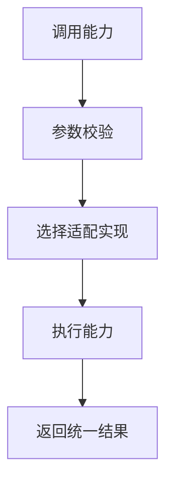

# <能力域中文名>能力文档

> 文档层级：能力域级
> 能力域名称：<能力域中文名>
> 能力域标识：<capability-slug>
> 文档状态：初稿 | 已评审 | 待补充
> 更新日期：YYYY-MM-DD

## 1. 能力职责

- 能力目标：
- 能力边界：
- 不负责事项：
- 上游调用方：
- 下游依赖：
- 可信度说明：

## 2. 核心能力对象

| 对象 | 定义 | 生命周期 | 关键状态/属性 | 状态 |
| --- | --- | --- | --- | --- |
| <能力对象> | <定义> | <生命周期> | <状态/属性> | 已验证/待确认 |

## 3. 核心能力场景

| 场景编号 | 能力 | 场景名称 | 触发条件 | 调用方 | 输出 | 状态 |
| --- | --- | --- | --- | --- | --- | --- |
| CS-<CAP>-001 | <能力> | <场景> | <条件> | <调用方> | <输出> | 已验证/待确认 |

## 4. 能力流程

图示状态：已根据事实补全 | 部分待确认 | 不适用，原因：

## 5. 公共抽象与标准能力判定

| 类型 | 内容 | 证据 | 是否可作为标准 |
| --- | --- | --- | --- |
| 公共抽象 | <接口/协议/流程骨架> | <证据> | 是 |
| 代表性实现 | <某个厂商/协议实现> | <证据> | 否 |
| 待确认规则 | <规则> | <证据不足> | 待确认 |

## 6. 能力规则

| 规则编号 | 规则类型 | 规则内容 | 适用范围 | 例外/差异 | 状态 |
| --- | --- | --- | --- | --- | --- |
| CR-001 | 共性规则/差异规则 | <规则> | <范围> | <例外> | 已验证/待确认 |

## 7. 待确认事项

| 编号 | 类型 | 问题 | 影响 | 建议处理 |
| --- | --- | --- | --- | --- |
| CQ-001 | 能力/边界/规则 | <问题> | <影响> | <建议> |
