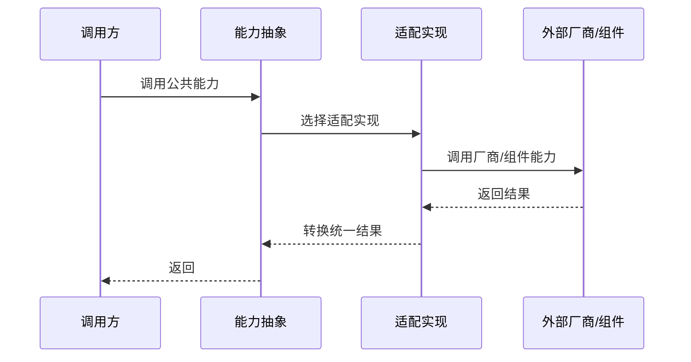

# <适配对象>-<能力场景中文名>能力适配说明

> 文档层级：能力适配详解
> 所属能力域：<能力域中文名>（<capability-slug>）
> 适配编号：CA-xxx
> 适配对象：<厂商/协议/SDK/部署形态>
> 文档状态：初稿 | 已评审 | 待补充
> 更新日期：YYYY-MM-DD

## 1. 适配对象与适用范围

- 适配对象：
- 适用技术能力：
- 适用运行环境/部署形态：
- 关键配置：
- 不适用范围：
- 可信度说明：

## 2. 能力调用流程

图示状态：已根据事实补全 | 部分待确认 | 不适用，原因：

## 3. 关键能力规则

| 规则编号 | 规则内容 | 触发条件 | 处理结果 | 与公共抽象差异 | 状态 |
| --- | --- | --- | --- | --- | --- |
| CAR-001 | <规则> | <条件> | <结果> | <差异> | 已验证/待确认 |

## 4. 配置、资源与依赖差异

| 类型 | 差异项 | 说明 | 证据 |
| --- | --- | --- | --- |
| 配置 | <endpoint/bucket/topic 等> | <说明> | <path> |
| 依赖 | <SDK/组件> | <说明> | <path> |
| 资源 | <存储/MQ/缓存/文件/密钥> | <说明> | <path> |
| 权限 | <认证/授权> | <说明> | <path> |

## 5. 异常、重试与降级

| 场景 | 处理方式 | 是否重试 | 是否降级 | 证据状态 |
| --- | --- | --- | --- | --- |
| <异常场景> | <处理> | 是/否 | 是/否 | 已验证/待确认 |

## 6. 技术落地索引

- 能力抽象：
- 适配实现：
- 配置类：
- SDK/Client：
- 资源声明：
- 测试：

## 7. 源码证据

| 结论 | 证据路径 | 证据类型 | 状态 |
| --- | --- | --- | --- |
| <结论> | <path> | 源码/测试/配置/文档/用户确认 | 已验证/待确认 |

## 8. 待确认事项

| 编号 | 问题 | 影响 | 建议处理 |
| --- | --- | --- | --- |
| CAQ-001 | <问题> | <影响> | <建议> |
