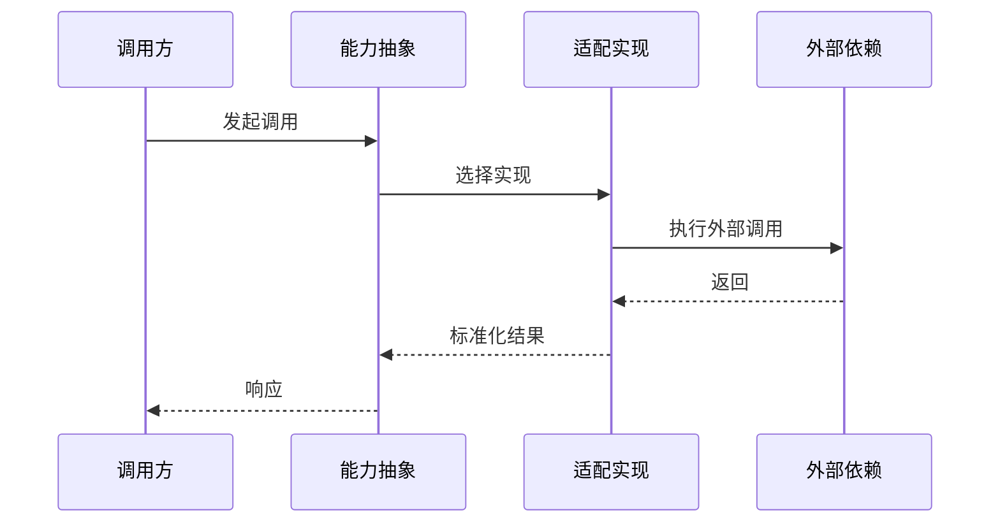

# <能力域中文名>运行文档

> 文档层级：能力域级
> 能力域名称：<能力域中文名>
> 能力域标识：<capability-slug>
> 文档状态：初稿 | 已评审 | 待补充
> 更新日期：YYYY-MM-DD

## 1. 运行职责边界

- 入口/API/任务：
- 编排组件：
- 适配组件：
- 外部依赖：
- 不属于本能力域的运行职责：

## 2. 场景运行落地

| 场景编号 | 能力 | 适配对象 | 入口/API/消息/任务 | 编排组件 | 适配实现 | 外部依赖 | 事务/一致性 | 异常路径 | 验证方式 | 状态 |
| --- | --- | --- | --- | --- | --- | --- | --- | --- | --- | --- |
| CS-xxx | <能力> | <全部/某适配> | <入口> | <组件> | <实现> | <依赖> | <边界> | <异常> | <验证> | 已验证/待确认 |

## 3. 核心调用时序

图示状态：已根据事实补全 | 部分待确认 | 不适用，原因：

## 4. 运行治理

| 治理项 | 规则 | 适用对象 | 状态 |
| --- | --- | --- | --- |
| 超时 | <规则> | <对象> | 已验证/待确认 |
| 重试 | <规则> | <对象> | 已验证/待确认 |
| 降级 | <规则> | <对象> | 已验证/待确认 |
| 监控 | <规则> | <对象> | 已验证/待确认 |

## 5. 待确认事项

| 编号 | 类型 | 问题 | 影响 | 建议处理 |
| --- | --- | --- | --- | --- |
| RQ-001 | 运行/异常/观测 | <问题> | <影响> | <建议> |
