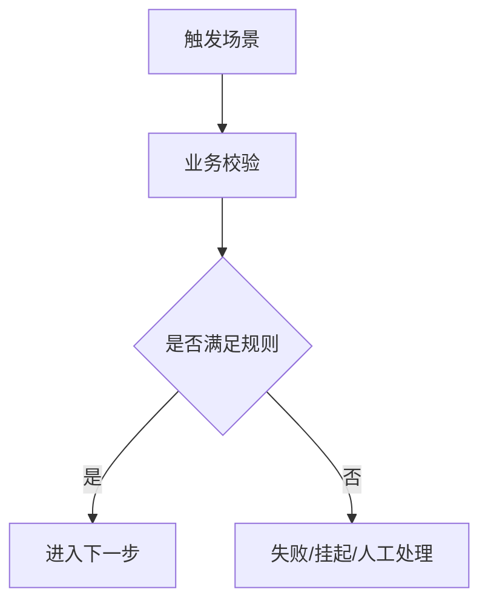
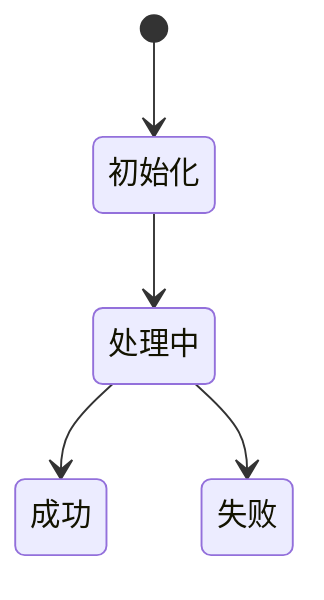

# <领域中文名>业务文档

> 文档层级：领域级
> 领域名称：<领域中文名>
> 领域标识：<domain-slug>
> 文档状态：初稿 | 已评审 | 待补充
> 更新日期：

## 1. 领域职责

- 领域目标：
- 领域边界：
- 不负责事项：
- 上游协作：
- 下游协作：
- 可信度说明：

## 2. 核心业务对象

| 对象 | 定义 | 生命周期 | 关键状态 | 状态 |
| --- | --- | --- | --- | --- |
| <业务对象> | <定义> | <生命周期> | <状态> | 已验证/待确认 |

## 3. 核心业务场景

| 场景编号 | 业务能力 | 场景名称 | 触发条件 | 参与方 | 输出 | 状态 |
| --- | --- | --- | --- | --- | --- | --- |
| BS-<DOMAIN>-001 | <能力> | <场景> | <条件> | <参与方> | <输出> | 已验证/待确认 |

## 4. 场景业务流程

图示状态：已根据事实补全 | 部分待确认 | 不适用，原因：

## 5. 业务适配矩阵

> 没有横向对比时，不得定义标准流程。

| 业务能力 | 适配对象 | 适用场景 | 共性规则 | 差异规则 | 状态差异 | 数据差异 | 详解文档 | 是否可作为标准 | 状态 |
| --- | --- | --- | --- | --- | --- | --- | --- | --- | --- |
| <能力> | <资方/渠道/产品/策略> | BS-xxx | <共性> | <差异> | <差异> | <差异> | `adaptations/<slug>-<场景>业务适配说明.md` | 是/否/待确认 | 已验证/待确认 |

## 6. 公共抽象与标准流程判定

| 类型 | 内容 | 证据 | 是否可作为标准 |
| --- | --- | --- | --- |
| 公共抽象 | <接口/规则/流程骨架> | <证据> | 是 |
| 代表性业务适配 | <某个适配对象流程> | <证据> | 否 |
| 待确认规则 | <规则> | <证据不足> | 待确认 |

## 7. 业务规则

| 规则编号 | 规则类型 | 规则内容 | 适用范围 | 例外/差异 | 状态 |
| --- | --- | --- | --- | --- | --- |
| BR-001 | 共性规则/适配差异规则 | <规则> | <范围> | <例外> | 已验证/待确认 |

## 8. 状态流转

图示状态：已根据事实补全 | 部分待确认 | 不适用，原因：

## 9. 异常分支

| 场景 | 异常 | 处理方式 | 是否影响状态 | 状态 |
| --- | --- | --- | --- | --- |
| <场景> | <异常> | <处理> | 是/否 | 已验证/待确认 |

## 10. 待确认事项

| 编号 | 类型 | 问题 | 影响 | 建议处理 |
| --- | --- | --- | --- | --- |
| BQ-001 | 业务/领域边界/规则 | <问题> | <影响> | <建议> |
