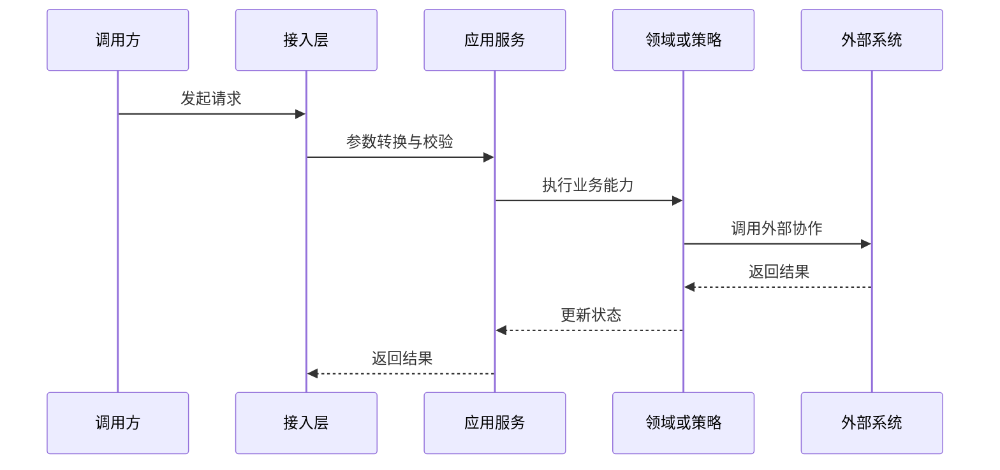
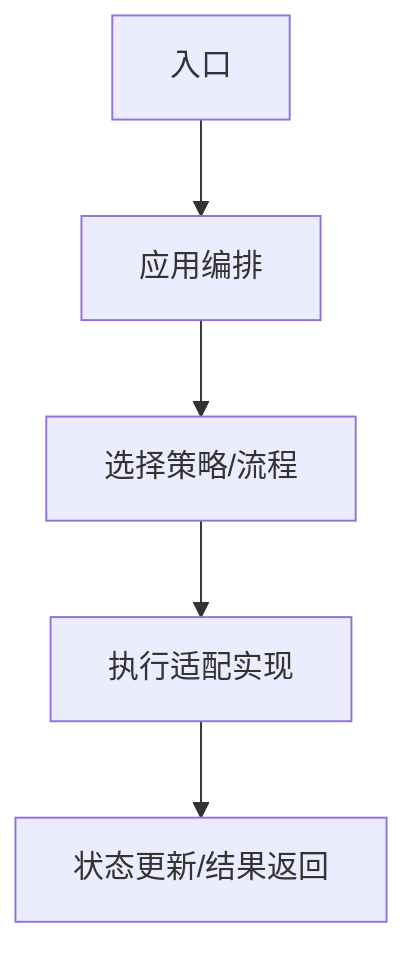

# <领域中文名>技术文档

> 文档层级：领域级
> 领域名称：<领域中文名>
> 领域标识：<domain-slug>
> 文档状态：初稿 | 已评审 | 待补充
> 更新日期：

## 1. 技术职责边界

- 接入层：
- 应用编排层：
- 领域/策略层：
- 基础设施层：
- 外部协作：
- 不属于本领域的技术职责：

## 2. 场景技术落地

| 场景编号 | 业务能力 | 适用适配对象 | 入口/API/消息/任务 | 应用编排 | 领域对象/方法 | 数据访问 | 外部协作 | 事务边界 | 异常路径 | 验证方式 | 状态 |
| --- | --- | --- | --- | --- | --- | --- | --- | --- | --- | --- | --- |
| BS-xxx | <能力> | <适配对象/全部> | <入口> | <服务> | <领域对象> | <Mapper/Repo> | <外部> | <事务> | <异常> | <验证> | 已验证/待确认 |

## 3. 核心调用时序

图示状态：已根据事实补全 | 部分待确认 | 不适用，原因：

## 4. 业务适配技术落地矩阵

| 业务能力 | 适配对象 | 入口/契约 | 应用编排 | 策略/流程/扩展点 | Adapter/Gateway/Remote | DTO/参数转换 | 状态映射 | 幂等/重试 | 适配说明 | 不得修改的公共抽象 | 状态 |
| --- | --- | --- | --- | --- | --- | --- | --- | --- | --- | --- |
| <能力> | <适配对象> | <入口> | <服务> | <Process/Strategy/Handler> | <网关> | <DTO> | <映射> | <规则> | `adaptations/<slug>-<场景>业务适配说明.md` | <公共接口> | 已验证/待确认 |

## 5. 公共抽象

| 公共抽象 | 作用 | 实现方 | 代码位置 | 是否标准 |
| --- | --- | --- | --- | --- |
| <接口/抽象类> | <作用> | <实现列表> | <path> | 是/否 |

## 6. 代表性实现

> 代表性实现只能作为样例，不得直接写成标准流程。

| 适配对象 | 代码位置 | 适用场景 | 特有流程 | 特有风险 |
| --- | --- | --- | --- | --- |
| <适配对象> | <path> | <场景> | <流程> | <风险> |

## 7. 技术流程图

图示状态：已根据事实补全 | 部分待确认 | 不适用，原因：

## 8. 接口与集成契约

| 接口/集成点 | 类型 | 调用方 | 提供方 | 业务目的 | 请求关键字段 | 响应关键字段 | 鉴权/权限 | 幂等/一致性 | 异常处理 | 代码位置 | 状态 |
| --- | --- | --- | --- | --- | --- | --- | --- | --- | --- | --- | --- |
| <接口> | HTTP/RPC/MQ/Job/Webhook | <调用方> | <提供方> | <目的> | <字段> | <字段> | <规则> | <规则> | <异常> | <path> | 已验证/待确认 |

## 9. 测试与验证

| 场景编号 | 适用适配对象 | 验证方式 | 覆盖重点 | 状态 |
| --- | --- | --- | --- | --- |
| BS-xxx | <适配对象> | 单元/集成/契约/手动 | 规则/异常/事务/状态映射/幂等 | 已验证/待确认 |

## 10. 待确认事项

| 编号 | 类型 | 问题 | 影响 | 建议处理 |
| --- | --- | --- | --- | --- |
| TQ-001 | 技术/接口/状态/幂等 | <问题> | <影响> | <建议> |
