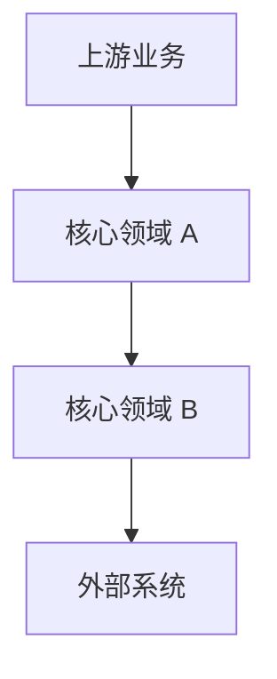

# 项目业务架构文档

> 文档层级：项目级
> 文档状态：初稿 | 已评审 | 待补充
> 更新日期：

## 1. 项目业务定位

- 一句话定位：
- 核心业务目标：
- 主要业务参与方：
- 不在本项目范围内的业务：

## 2. 业务领域总览

| 领域 | 领域职责 | 核心业务能力 | 上游/下游 | 状态 |
| --- | --- | --- | --- | --- |
| <领域> | <职责> | <能力> | <协作方> | 已验证/待确认 |

## 3. 项目级业务流程

图示状态：已根据事实补全 | 部分待确认 | 不适用，原因：

## 4. 跨领域协作

| 协作链路 | 参与领域 | 触发场景 | 关键业务规则 | 状态 |
| --- | --- | --- | --- | --- |
| <链路> | <领域 A/领域 B> | <场景> | <规则> | 已验证/待确认 |

## 5. 项目级业务规则

| 规则编号 | 规则 | 适用范围 | 证据来源 | 状态 |
| --- | --- | --- | --- | --- |
| BR-001 | <规则> | <范围> | 用户/文档/代码/测试 | 已验证/待确认 |

## 6. 业务适配风险

| 业务能力 | 适配类型 | 典型实现 | 风险 | 是否需要领域建模 |
| --- | --- | --- | --- | --- |
| <能力> | 渠道/策略/产品/供应方/流程 | <实现> | 可能把单实现误判为标准 | 是/否 |

## 7. 待确认事项

| 编号 | 问题 | 影响 | 建议处理 |
| --- | --- | --- | --- |
| BQ-001 | <问题> | <影响> | <建议> |
