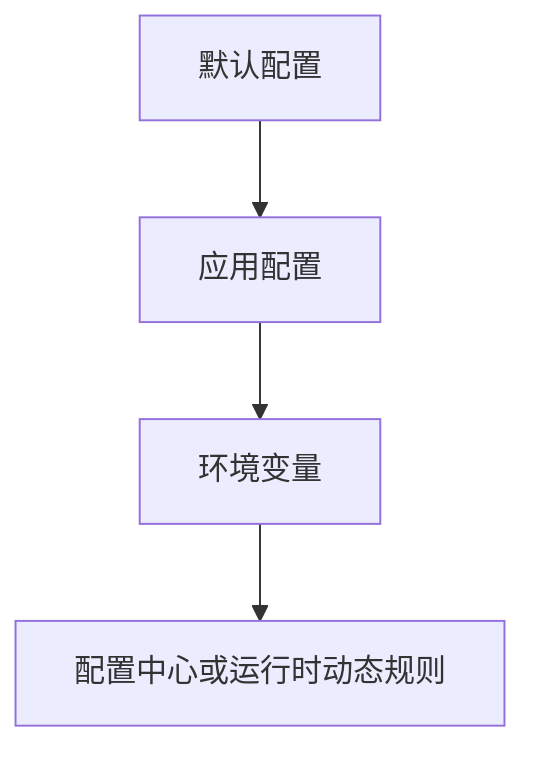

# 项目配置与资源架构文档

> 文档层级：项目级
> 文档状态：初稿 | 已评审 | 待补充
> 更新日期：

## 1. 配置与资源架构定位

- 配置架构目标：
- 核心配置主线：
- 当前可信度：
- 不在本阶段展开的内容：

## 2. 核心配置对象

| 配置对象 | 所属能力域 | 含义 | 来源 | 默认值策略 | 风险 |
| --- | --- | --- | --- | --- | --- |
| <配置对象> | <能力域> | <含义> | application/配置中心/环境变量 | <策略> | <风险> |

## 3. 运行时资源对象

| 资源对象 | 所属能力域 | 生命周期 | 所有权 | 使用方 | 治理要求 |
| --- | --- | --- | --- | --- | --- |
| <资源> | <能力域> | 启动期/运行期/关闭期 | <所有方> | <使用方> | <要求> |

## 4. 配置优先级

图示状态：已根据事实补全 | 部分待确认 | 不适用，原因：

## 5. 配置所有权与变更风险

| 配置或资源 | 事实源 | 允许修改方 | 只读消费方 | 风险 |
| --- | --- | --- | --- | --- |
| <对象> | <事实源> | <修改方> | <消费方> | <风险> |

## 6. 治理规则

| 规则 | 适用对象 | 说明 | 状态 |
| --- | --- | --- | --- |
| 配置可信源 | 所有配置对象 | 不从单个样例推断全局配置标准 | 已验证/待确认 |

## 7. 待确认事项

| 编号 | 问题 | 影响 | 建议处理 |
| --- | --- | --- | --- |
| CQ-001 | <问题> | <影响> | <建议> |
