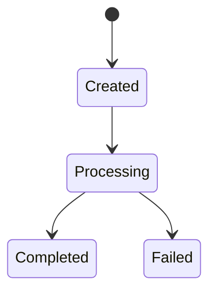
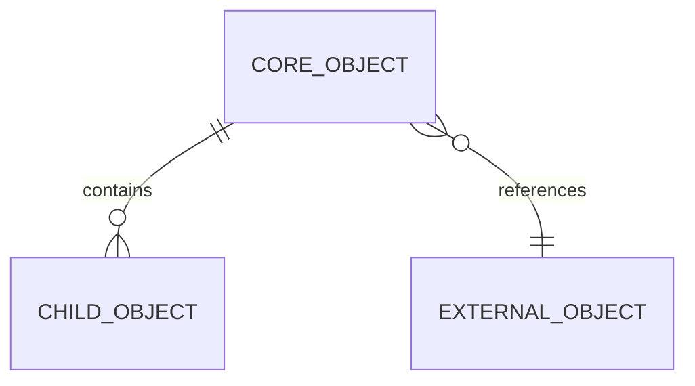

# 项目数据架构文档

> 文档层级：项目级
> 文档状态：初稿 | 已评审 | 待补充
> 更新日期：

## 1. 数据架构定位

- 数据架构目标：
- 核心数据主线：
- 当前数据可信度：
- 不在本阶段展开的内容：

## 2. 核心业务对象

| 业务对象 | 归属领域 | 业务含义 | 创建来源 | 主要状态 | 消费方 | 可信状态 |
| --- | --- | --- | --- | --- | --- | --- |
| <对象> | <领域> | <含义> | <来源> | <状态> | <领域/系统> | 已验证/待确认 |

## 3. 业务对象生命周期

| 业务对象 | 创建时机 | 关键状态变化 | 终态 | 主要写入方 | 主要读取方 | 风险 |
| --- | --- | --- | --- | --- | --- | --- |
| <对象> | <时机> | <状态变化> | <终态> | <领域/模块> | <领域/模块> | <风险> |

图示状态：已根据事实补全 | 部分待确认 | 不适用，原因：

## 4. 项目级 ER 关系

图示状态：已根据事实补全 | 部分待确认 | 不适用，原因：

## 5. 跨领域数据流

图示状态：已根据事实补全 | 部分待确认 | 不适用，原因：

## 6. 数据所有权与事实源

| 数据对象 | 事实源领域 | 允许写入方 | 只读消费方 | 同步/冗余说明 | 状态 |
| --- | --- | --- | --- | --- | --- |
| <对象> | <领域> | <写入方> | <消费方> | <说明> | 已验证/待确认 |

## 7. 一致性与补偿风险

| 场景 | 涉及对象 | 一致性要求 | 幂等/补偿方式 | 风险等级 | 待确认问题 |
| --- | --- | --- | --- | --- | --- |
| <场景> | <对象> | <要求> | <方式> | 高/中/低 | <问题> |

## 8. 数据治理规则

| 规则 | 适用对象 | 说明 | 状态 |
| --- | --- | --- | --- |
| DDL 可信源 | 所有持久化对象 | 不从实体/Mapper 推断 DDL | 已验证 |
| 状态字段解释 | 核心状态对象 | 状态必须能解释业务进度 | 待确认 |
| 数据所有权 | 核心业务对象 | 必须明确事实源，不把同步副本写成主数据 | 待确认 |

## 9. DDL/SQL 参考状态

| 数据库/服务 | 业务模型 | 参考来源 | 处理状态 |
| --- | --- | --- | --- |
| <db/service> | <model> | MCP/已有 SQL/待确认 | 已验证/待确认 |

说明：本技能不创建、复制、导入或更新 `.specify/sql/**/*.sql`。本章节只记录已有可信 SQL/DDL 或数据库 MCP 事实的参考状态。
