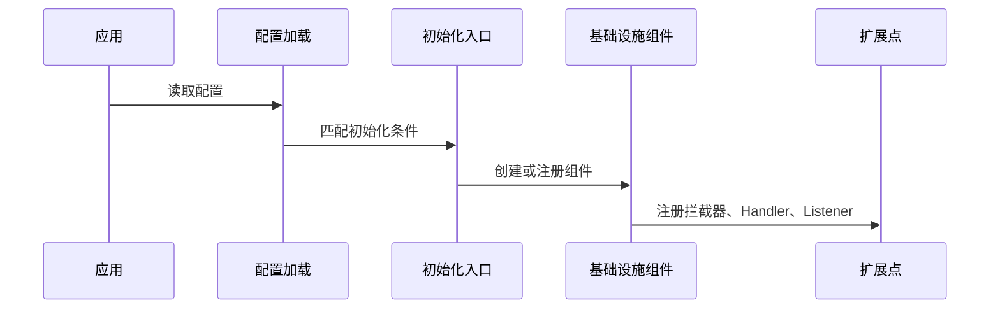

# 项目运行架构文档

> 文档层级：项目级
> 文档状态：初稿 | 已评审 | 待补充
> 更新日期：

## 1. 运行时组件

| 组件 | 职责 | 生命周期 | 依赖 | 状态 |
| --- | --- | --- | --- | --- |
| <组件> | <职责> | 启动期/运行期/关闭期 | <依赖> | 已验证/待确认 |

## 2. 初始化链路

图示状态：已根据事实补全 | 部分待确认 | 不适用，原因：

## 3. 运行时调用链

| 调用链 | 参与组件 | 触发场景 | 关键约束 | 状态 |
| --- | --- | --- | --- | --- |
| <链路> | <组件 A/组件 B> | <场景> | <约束> | 已验证/待确认 |

## 4. 运行风险

| 风险 | 影响 | 建议建模 |
| --- | --- | --- |
| <风险> | <影响> | <能力域> |

## 5. 待确认事项

| 编号 | 问题 | 影响 | 建议处理 |
| --- | --- | --- | --- |
| RQ-001 | <问题> | <影响> | <建议> |
