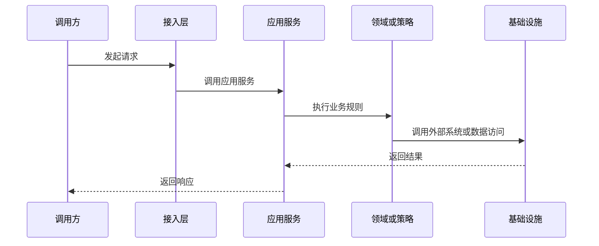

# 项目技术架构文档

> 文档层级：项目级
> 文档状态：初稿 | 已评审 | 待补充
> 更新日期：

## 1. 技术架构总览

- 技术栈：
- 模块结构：
- 主要运行入口：
- 核心技术模式：
- 外部依赖：

## 2. 模块职责

| 模块 | 职责 | 主要领域 | 关键入口 | 状态 |
| --- | --- | --- | --- | --- |
| <module> | <职责> | <领域> | <Controller/RPC/Job/MQ> | 已验证/待确认 |

## 3. 项目级调用链

图示状态：已根据事实补全 | 部分待确认 | 不适用，原因：

## 4. 公共技术模式

| 技术模式 | 适用场景 | 公共抽象 | 典型实现 | 注意事项 |
| --- | --- | --- | --- | --- |
| <模式> | <场景> | <接口/类> | <实现> | 单实现不得冒充标准 |

## 5. 多实现技术扩展点

| 扩展点 | 业务能力 | 实现类型 | 公共抽象 | 实现目录 | 风险 |
| --- | --- | --- | --- | --- | --- |
| <扩展点> | <能力> | Provider/Adapter/Strategy/Process | <公共接口> | <path> | <风险> |

## 6. 项目级非功能约束

| 约束 | 说明 | 当前状态 |
| --- | --- | --- |
| 幂等 | <说明> | 已验证/待确认 |
| 事务 | <说明> | 已验证/待确认 |
| 日志与追踪 | <说明> | 已验证/待确认 |
| 安全 | <说明> | 已验证/待确认 |

## 7. 待确认事项

| 编号 | 问题 | 影响 | 建议处理 |
| --- | --- | --- | --- |
| TQ-001 | <问题> | <影响> | <建议> |

