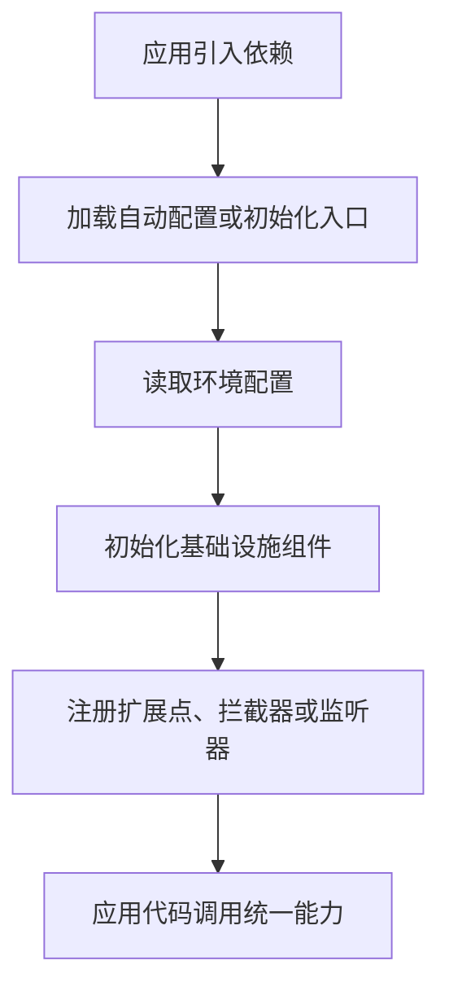

# 项目技术能力架构文档

> 文档层级：项目级
> 文档状态：初稿 | 已评审 | 待补充
> 更新日期：

## 1. 项目技术定位

- 一句话定位：
- 核心技术目标：
- 主要使用方：
- 不在本项目范围内的内容：

## 2. 技术能力域总览

| 技术能力域 | 职责 | 核心平台能力 | 使用方 | 状态 |
| --- | --- | --- | --- | --- |
| <能力域> | <职责> | <能力> | <使用方> | 已验证/待确认 |

## 3. 技术接入流程

图示状态：已根据事实补全 | 部分待确认 | 不适用，原因：

## 4. 扩展点与能力适配风险

| 扩展点 | 适用场景 | 适配对象 | 风险 | 是否需要能力建模 |
| --- | --- | --- | --- | --- |
| <扩展点> | <场景> | Starter/SPI/Plugin/配置/部署模式 | 单实现误判为标准 | 是/否 |

## 5. 平台级技术规则

| 规则编号 | 规则 | 适用范围 | 证据来源 | 状态 |
| --- | --- | --- | --- | --- |
| TR-001 | <规则> | <范围> | 用户/文档/代码/测试 | 已验证/待确认 |

## 6. 待确认事项

| 编号 | 问题 | 影响 | 建议处理 |
| --- | --- | --- | --- |
| TQ-001 | <问题> | <影响> | <建议> |
