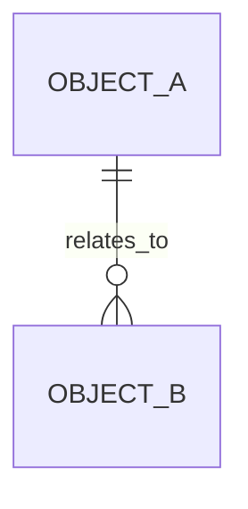

# <中文领域名>数据架构

> 领域名称：<中文领域名，如订单域>
> 领域标识：<domain-slug，如 order>
> 文档状态：初稿 | 已评审 | 待补充
> 更新日期：YYYY-MM-DD

## 1. 数据职责边界

- 领域数据对象：
- 外部引用数据：
- 不归属本领域的数据：
- 数据一致性边界：

## 2. 数据对象

| 数据对象 | 业务含义 | 生命周期 | SQL/DDL 参考 | 状态 |
| --- | --- | --- | --- | --- |
| <数据对象> | <业务含义> | <生命周期> | <已有 SQL 路径/真实 DDL 已核对不落盘/待确认/无> | 已验证/待确认 |

## 3. 业务对象生命周期

| 业务对象 | 产生场景 | 关键状态/字段语义 | 更新场景 | 消费场景 | 终态/归档 | 状态 |
| --- | --- | --- | --- | --- | --- | --- |
| <业务对象> | BS-<DOMAIN>-001 | <状态/字段含义> | <更新时机> | <消费方/下游> | <终态或归档规则> | 已验证/待确认 |

## 4. 业务能力变体数据差异

> 当同一业务能力存在多个实现变体时，必须记录数据口径、字段、状态或外部标识差异。
> 如果没有稳定变体，写明“不适用，原因”，不得留空。

| 业务能力 | 业务变体 | 主数据对象 | 变体特有数据 | 状态/字段映射差异 | 外部标识/流水 | 一致性风险 | 状态 |
| --- | --- | --- | --- | --- | --- | --- | --- |
| <能力名称> | <变体名称> | <对象> | <字段/扩展对象/配置> | <映射差异> | <外部单号/渠道流水/第三方标识> | <风险> | 已验证/待确认 |

## 5. 数据关系

图示状态：不适用，原因 | 已根据事实补全 | 部分节点待确认

## 6. SQL/DDL 参考索引

| 数据库/服务 | 业务模型 | 参考来源 | 数据表 | 处理状态 |
| --- | --- | --- | --- | --- |
| <database_or_service> | <business_model> | <已有 SQL 路径/真实 DDL 已核对不落盘/待确认/无> | <table_names> | 已验证/待确认 |

## 7. 数据流转

| 场景编号 | 适用变体 | 产生数据 | 变更数据 | 消费方 | 一致性要求 | 风险 |
| --- | --- | --- | --- | --- | --- | --- |
| BS-<DOMAIN>-001 | <全部/某变体> | <来源> | <对象/状态/字段> | <消费方> | <强一致/最终一致/待确认> | <风险> |

## 8. 数据质量与治理

| 治理项 | 规则 | 适用对象 | 状态 |
| --- | --- | --- | --- |
| <治理项> | <规则> | <对象> | 已验证/待确认 |

## 9. 领域内待确认事项

| 编号 | 类型 | 问题 | 影响 | 建议处理 |
| --- | --- | --- | --- | --- |
| DQ-001 | 业务/技术/数据/测试/领域归属 | <问题> | <影响> | <处理方式> |
