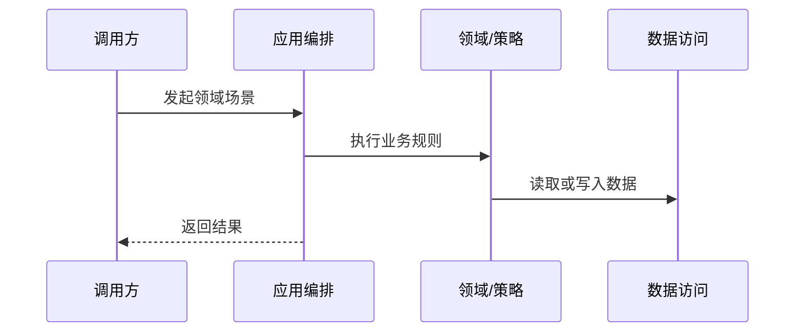

# <中文领域名>技术架构

> 领域名称：<中文领域名，如订单域>
> 领域标识：<domain-slug，如 order>
> 文档状态：初稿 | 已评审 | 待补充
> 更新日期：YYYY-MM-DD

## 1. 技术职责边界

- 接入层：
- 应用编排层：
- 领域/策略层：
- 基础设施层：
- 外部协作：

## 2. 场景技术落地

| 场景编号 | 业务能力 | 适用变体 | 入口/API/消息/任务 | 应用编排 | 领域对象/方法 | 数据访问 | 外部协作 | 事务边界 | 异常路径 | 验证方式 | 状态 |
| --- | --- | --- | --- | --- | --- | --- | --- | --- | --- | --- | --- |
| BS-<DOMAIN>-001 | <能力名称> | <全部/某变体/不适用> | <入口> | <应用服务/用例> | <领域对象/领域方法> | <Repository/Mapper/已有 SQL 参考> | <外部系统> | <边界> | <异常/补偿> | <单元/集成/手动> | 已验证/待确认 |

## 3. 核心技术流程

图示状态：不适用，原因 | 已根据事实补全 | 部分节点待确认

## 4. 关键策略与规则落地

| 规则 | 技术落点 | 复用组件 | 异常处理 | 验证 |
| --- | --- | --- | --- | --- |
| <规则> | <类/方法/配置/策略> | <组件> | <处理> | <测试或手动验证> |

## 5. 能力变体技术落地矩阵

> 当同一业务能力存在多个实现变体时，必须把业务差异落到技术扩展点。
> 如果没有稳定变体，写明“不适用，原因”，不得留空。

| 业务能力 | 业务变体 | 入口/契约 | 应用编排 | 策略/流程/扩展点 | 适配器/网关/外部协作 | DTO/参数转换 | 状态映射 | 幂等/重试 | 不得修改的公共抽象 | 状态 |
| --- | --- | --- | --- | --- | --- | --- | --- | --- | --- | --- |
| <能力名称> | <变体名称> | <Controller/RPC/MQ/Job> | <应用服务> | <Strategy/Handler/Process/Step> | <Adapter/Gateway/Remote> | <转换规则> | <状态映射> | <幂等与重试规则> | <公共接口/流程/模型> | 已验证/待确认 |

## 6. 对外接口与集成契约

> 只记录已存在或已验证的领域边界入口，例如 Controller、RPC、MQ、Job、Webhook、第三方回调。
> 没有事实依据时不得臆造接口；没有对外接口时写明“不适用，原因”。

| 接口/集成点 | 类型 | 调用方 | 提供方 | 业务目的 | 请求关键字段 | 响应关键字段 | 鉴权/权限 | 幂等/一致性 | 异常处理 | 代码位置 | 状态 |
| --- | --- | --- | --- | --- | --- | --- | --- | --- | --- | --- | --- |
| <接口> | HTTP/RPC/MQ/Job/Webhook | <调用方> | <提供方> | <目的> | <字段> | <字段> | <规则> | <规则> | <异常> | <path> | 已验证/待确认 |

## 7. 内部协作契约

> 仅记录稳定的领域内部协作边界，例如应用服务、领域服务、策略接口、Repository、外部网关接口。
> 普通私有方法、临时工具方法、未稳定抽象不进入本节。

| 协作点 | 调用方 | 被调用方 | 输入语义 | 输出语义 | 关键约束 | 代码位置 | 状态 |
| --- | --- | --- | --- | --- | --- | --- | --- |
| <协作点> | <调用方> | <被调用方> | <输入> | <输出> | <约束> | <path> | 已验证/待确认 |

## 8. 测试与验证约束

| 场景编号 | 适用变体 | 验证方式 | 覆盖重点 | 状态 |
| --- | --- | --- | --- | --- |
| BS-<DOMAIN>-001 | <全部/某变体> | <单元/集成/契约/手动> | <规则/异常/事务/状态映射/幂等> | 已验证/待确认 |

## 9. 领域内待确认事项

| 编号 | 类型 | 问题 | 影响 | 建议处理 |
| --- | --- | --- | --- | --- |
| TQ-001 | 业务/技术/数据/测试/领域归属 | <问题> | <影响> | <处理方式> |
