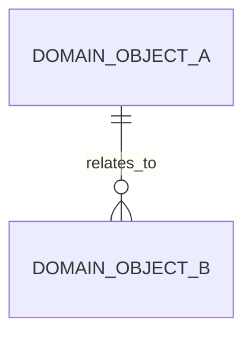

# 项目数据架构总览

> 适用范围：<系统或项目>
> 文档状态：初稿 | 已评审 | 待补充
> 更新日期：YYYY-MM-DD

## 1. 数据定位

- 核心数据域：
- 全局数据边界：
- 数据治理目标：

## 2. 数据域总览

| 数据域 | 归属领域 | 核心数据对象 | 二级数据文档 | 状态 |
| --- | --- | --- | --- | --- |
| <数据域> | <中文领域名（domain-slug）> | <对象列表> | `.specify/memory/domains/<domain-slug>/数据架构.md` | 已验证/待确认 |

## 3. 跨领域数据关系

图示状态：不适用，原因 | 已根据事实补全 | 部分节点待确认

## 4. SQL/DDL 参考总索引

| 数据库/服务 | 业务模型 | 归属领域 | 参考来源 | 处理状态 |
| --- | --- | --- | --- | --- |
| <database_or_service> | <business_model> | <中文领域名（domain-slug）> | <已有 SQL 路径/真实 DDL 已核对不落盘/待确认/无> | 已验证/待确认 |

## 5. 数据治理约束

| 治理项 | 规则 | 适用领域 | 状态 |
| --- | --- | --- | --- |
| <治理项> | <规则> | <中文领域名（domain-slug）> | 已验证/待确认 |

## 6. 待确认事项

| 编号 | 问题 | 影响 | 建议处理 |
| --- | --- | --- | --- |
| DQ-001 | <问题> | <影响> | <处理方式> |

