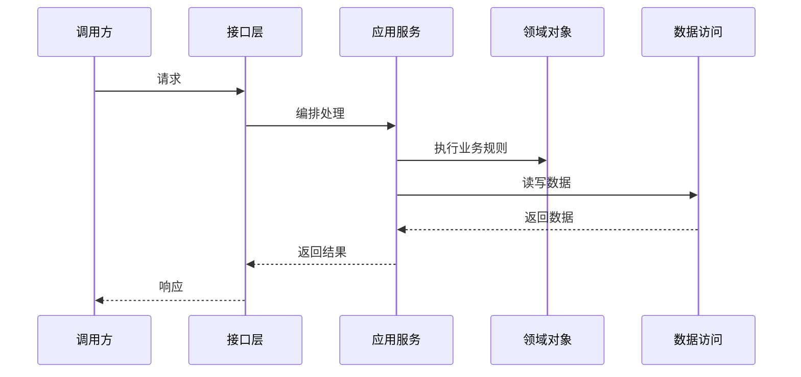
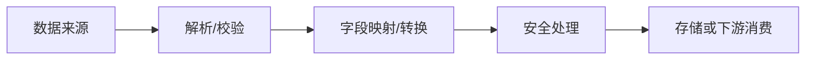
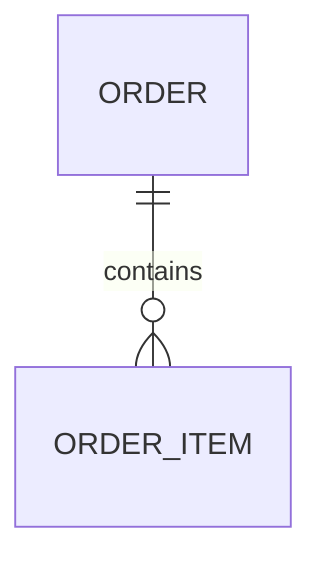
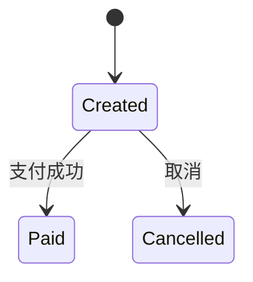

# <功能名称>技术设计说明书

> 功能标识：`<feature-slug>`
> SDD 等级：`S1 | S2`
> 来源需求：`spec/features/<yyyymmdd>/<功能中文名>-需求说明书.md`
> 文档状态：初稿
> 创建日期：YYYY-MM-DD
> 更新日期：YYYY-MM-DD

## 1. 设计概要

- 功能描述：
- 影响模块：
- 关键技术点：
- 依赖关系：
- 非目标：
- SDD 等级理由：

## 2. 架构与调用链路

- 涉及入口：
- 涉及模块：
- 涉及服务：
- 涉及领域对象：
- 涉及数据访问：
- 外部依赖：
- 调用链路：



> 无复杂调用链时写：`不适用，原因`。

## 3. API / RPC / 消息契约设计

### 3.1 接口列表

| 接口名称 | 类型 | 方法/Topic | 路径/标识 | 描述 | AC |
| --- | --- | --- | --- | --- | --- |
| <接口> | REST/RPC/消息/任务 | POST | /api/xxx | <说明> | AC-001 |

### 3.2 接口详情

#### <接口名称>

- 路径/标识：
- 鉴权要求：
- 请求参数：

```json
{
  "field": "value"
}
```

- 成功响应：

```json
{
  "code": 200,
  "data": {}
}
```

- 失败响应：

```json
{
  "code": 400,
  "message": "错误信息"
}
```

- 兼容性：
- 错误码：
- 契约文件：无 | `contracts/<name>.md`

## 4. 数据模型与 DDL 影响

### 4.1 数据影响判断

| 检查项 | 是否涉及 | 处理要求 |
| --- | --- | --- |
| 持久化数据新增、修改、删除或查询 | 是/否 | <不适用原因或设计要求> |
| 外部数据入库、出库、同步、对账或报表 | 是/否 | <不适用原因或设计要求> |
| 字段映射、金额、日期、状态、流水号或客户标识 | 是/否 | <不适用原因或设计要求> |
| 敏感数据、权限、安全、脱敏、加密、审计或保留期限 | 是/否 | <不适用原因或设计要求> |
| 跨系统、跨服务、跨库或第三方数据流转 | 是/否 | <不适用原因或设计要求> |

### 4.2 字段映射契约

仅当涉及文件入库、接口入库、数据同步、对账、报表、迁移或跨系统数据流转时生成；不涉及时写 `不适用，原因`。

| 来源数据项 | 来源含义 | 来源类型/格式 | 目标数据项 | 目标含义 | 转换规则 | 空值/异常规则 | 安全要求 | 确认状态 |
| --- | --- | --- | --- | --- | --- | --- | --- | --- |
| <来源> | <含义> | <类型/格式/单位> | <目标> | <含义> | <转换> | <规则> | <脱敏/加密/权限/无> | 已确认/待确认 |

> 金额、日期、状态、流水号、客户标识、合同号、外部编号、敏感字段等关键项不得留为 `待确认` 后进入实现。

### 4.3 数据流设计



> 无跨系统、入库、出库、同步、对账、报表或复杂数据流时写：`不适用，原因`。

### 4.4 数据安全与合规设计

| 检查项 | 设计结论 | 验证方式 |
| --- | --- | --- |
| 敏感数据识别 | 不适用 | <原因或字段类别> |
| 传输安全 | 不适用 | <验证方式> |
| 存储加密 | 不适用 | <验证方式> |
| 展示/日志脱敏 | 不适用 | <验证方式> |
| 数据权限 | 不适用 | <验证方式> |
| 审计与追踪 | 不适用 | <验证方式> |
| 保留期限/删除/归档 | 不适用 | <验证方式> |
| 法规或公司治理要求 | 不适用 | <验证方式> |

### 4.5 数据结构变化

| 对象/表 | 字段/属性 | 变化 | 类型 | 默认值/约束 | 说明 |
| --- | --- | --- | --- | --- | --- |
| <对象> | <字段> | 新增/修改/删除 | <类型> | <约束> | <说明> |

### 4.6 ER 设计



> 无新增表、关系变化或多表协作时写：`不适用，原因`。

### 4.7 SQL/DDL 影响

- 是否涉及持久化结构变化：否 | 是
- SQL 知识快照：无 | `.specify/sql/<database_or_service>/<business_model>.sql`
- DDL 证据状态：不适用 | 数据库 MCP 可确认 | 仓库 SQL 可确认 | 待确认
- 迁移位置：不适用 | 项目既有迁移目录 | 待确认
- 执行型变更 DDL：不适用 | `<project-migration-path>.sql` | `spec/features/<yyyymmdd>/ddl-changes/<INIT|CR-xxx>-<database_or_service>-<business_model>.sql`
- 回滚思路：不适用 | 反向 DDL | 备份恢复 | 人工修复 | 待确认

> 设计阶段只记录影响、证据状态、目标路径和意图；不生成 SQL 文件，不从实体/ORM/Mapper 推断 `CREATE TABLE`。

## 5. 核心逻辑设计

### 5.1 <核心流程名称>

- 触发条件：
- 输入：
- 处理步骤：
- 输出：
- 异常分支：
- 幂等要求：

```text
function handle(input):
  validate(input)
  domain.executeRule()
  repository.save()
  return result
```

## 6. 领域建模与业务规则落地

| 业务规则/行为 | 归属对象 | 实现方式 | 验证方式 |
| --- | --- | --- | --- |
| <规则> | <领域对象/应用服务/策略类> | <方法/策略/校验> | <测试/手动验证> |

- DDD-lite 判断：
- 核心领域对象：
- 应用服务职责：
- 贫血模型例外：
- 基础设施依赖边界：

## 7. 状态流转设计

| 当前状态 | 触发动作 | 前置条件 | 目标状态 | 失败处理 | 幂等 |
| --- | --- | --- | --- | --- | --- |
| <状态> | <动作> | <条件> | <状态> | <处理> | <要求> |



> 无状态变化时写：`不适用，原因`。

## 8. 异常、安全、事务与性能

### 8.1 异常处理

| 异常场景 | 处理方式 | 用户可见结果 | 日志要求 |
| --- | --- | --- | --- |
| <场景> | <处理> | <结果> | <日志> |

### 8.2 安全与权限

- 鉴权：
- 权限：
- 数据校验：
- 敏感信息脱敏：
- 防注入/越权：

### 8.3 事务与一致性

- 事务边界：
- 一致性模型：
- 并发控制：
- 缓存一致性：
- MQ/事件一致性：
- 失败补偿：

### 8.4 性能

- 查询性能：
- 索引影响：
- 缓存策略：
- 限流策略：
- 预期性能指标：

## 9. 技术决策

- 决策 D-001：
  - 选择：
  - 原因：
  - 替代方案：
  - 影响：

- 新增依赖：否 | 是，原因
- 新增抽象：否 | 是，原因
- 不采用方案：

## 10. 验证策略、AC 映射与风险

### 10.1 验证策略

| 验证对象 | 验证方式 | 覆盖 AC |
| --- | --- | --- |
| <对象> | 单元测试/集成测试/契约测试/手动验证 | AC-001 |

### 10.2 AC 映射

| AC | 技术实现 | 验证方式 |
| --- | --- | --- |
| AC-001 | <实现点> | <测试方式> |

### 10.3 风险与回滚

| 编号 | 风险 | 影响 | 处理方式 |
| --- | --- | --- | --- |
| R-001 | <风险> | <影响> | <规避/接受/待确认> |

### 10.4 知识同步影响

- 是否需要知识同步：否 | 是
- 领域技术文档：无 | `.specify/memory/domains/<domain-slug>/<领域中文名>技术文档.md`
- 领域数据文档：无 | `.specify/memory/domains/<domain-slug>/<领域中文名>数据文档.md`
- 能力域运行文档：无 | `.specify/memory/capabilities/<capability-slug>/<能力域中文名>运行文档.md`
- 能力域配置与资源文档：无 | `.specify/memory/capabilities/<capability-slug>/<能力域中文名>配置与资源文档.md`
- 知识卡片：无 | `.specify/memory/domains/<domain-slug>/cards/<KC-xxx>-<slug>.md`
- SQL 知识快照：无 | `.specify/sql/<database_or_service>/<business_model>.sql`
- 知识同步标记：Knowledge Sync Needed: no
