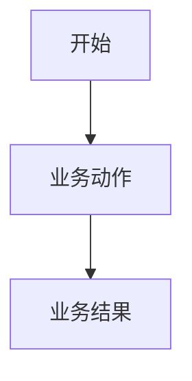

# <功能名称>需求说明书

> 功能标识：`<feature-slug>`
> 版本：V1.0.0
> 文档状态：初稿 | 已确认 | 草案-待确认
> 创建日期：YYYY-MM-DD
> 更新日期：YYYY-MM-DD
>
> **更新时间维护规则**：任何正文修改必须同步更新 `更新日期` 为本次修改日期，并在 `版本修订记录` 中追加变更记录。不得正文已变更而更新日期仍停留在旧日期。

## 一句话说明

用一句业务语言说明这个需求要解决什么问题、为谁产生价值。

## 需求澄清摘要

> 复杂业务场景可通过苏格拉底式五问澄清：业务目标、参与角色、核心流程、规则边界、验收信号。这里只记录确认后的业务结论，不记录完整问答日志。

### 已确认内容

| 序号 | 澄清问题 | 已确认结论 | 影响范围 |
| --- | --- | --- | --- |
| Q1 | <用户真正要解决的问题是什么？> | <确认后的业务结论> | <需求/流程/验收/范围> |

### 待确认内容

- 无 | <待确认问题，说明为什么暂时不阻塞当前需求说明书>

## 背景与目标

- 背景：<为什么要做这个需求>
- 当前问题：<现在有什么不便、缺口或风险>
- 目标：<完成后希望达到什么业务结果>
- 不做会怎样：<可选，说明业务影响>

## 需求范围

### 本次包含

- <本次明确要做的事项>

### 本次不包含

- <明确不在本次处理的事项>

## 角色与场景

| 角色或参与方 | 使用场景 | 触发条件 | 期望结果 |
| --- | --- | --- | --- |
| <角色> | <场景> | <什么时候发生> | <用户或业务可观察的结果> |

## 需求列表

| 需求编号 | 需求内容 | 优先级 | 关联场景 | 关联验收 |
| --- | --- | --- | --- | --- |
| REQ-001 | <用普通业务语言描述需求，不写类名、表名、字段名> | P0/P1/P2 | <场景> | AC-001 |

## 业务规则

| 规则编号 | 规则内容 | 适用场景 | 例外或边界 |
| --- | --- | --- | --- |
| BR-001 | <必须遵守的业务规则> | <场景> | <没有则写无> |

## 业务流程

### 主要流程

1. <业务步骤 1>
2. <业务步骤 2>
3. <业务步骤 3>

### 异常或分支

- 不适用，原因：<无异常或分支时说明原因>
- <有异常或分支时说明用户会看到什么、系统应如何响应>

### 流程图

不适用，原因：<没有明确流程或流程很简单时说明原因>

## 业务数据口径

只记录用户或业务方需要理解的数据含义，不记录表名、字段名、DDL、存储方案或技术模型。

### 数据影响判断

| 检查项 | 是否涉及 | 说明 |
| --- | --- | --- |
| 新增、修改、删除或查询持久化数据 | 是/否 | <说明> |
| 外部数据入库、出库、同步、对账或报表 | 是/否 | <说明> |
| 字段映射、金额、日期、状态、流水号或客户标识 | 是/否 | <说明> |
| 手机号、证件号、银行卡、合同、地址、交易流水等敏感数据 | 是/否 | <说明> |
| 跨系统、跨服务、跨库或第三方数据流转 | 是/否 | <说明> |

### 关键数据口径

| 业务对象/数据项 | 用户能理解的含义 | 来源或产生方式 | 单位/格式/状态口径 | 本次是否变化 | 是否关键 | 确认状态 |
| --- | --- | --- | --- | --- | --- | --- |
| <业务对象或数据项> | <业务含义> | <来源> | <单位、日期格式、状态含义等> | 是/否 | 是/否 | 已确认/待确认 |

> 若关键数据口径、字段映射、唯一性、权限、安全、合规或删除策略仍为 `待确认`，不得进入正式设计或实现；只有用户明确要求草案时，才能保留为 `文档状态：草案-待确认`。

## 影响说明

| 影响对象 | 影响说明 |
| --- | --- |
| <用户/业务流程/外部参与方/既有功能> | <新增、调整或无影响的说明> |

## 验收标准

- AC-001：Given <业务前提>, when <用户或系统动作>, then <可观察结果>。关联需求：REQ-001。

## 质量要求

- 性能：不适用，原因：<无特殊要求时说明原因>
- 安全：不适用，原因：<无特殊要求时说明原因>
- 兼容：不适用，原因：<无特殊要求时说明原因>
- 可用性：不适用，原因：<无特殊要求时说明原因>

## 风险与待确认

### 风险

- 无 | <可能影响需求实现或验收的业务风险>

### 假设

- 无 | <当前按什么前提继续>

### 待确认

- 无 | <不阻塞当前文档但后续需要确认的问题>

## 版本修订记录

| 日期 | 版本 | 说明 |
| --- | --- | --- |
| YYYY-MM-DD | V1.0.0 | 初始化需求说明书 |
