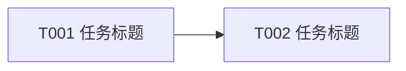

# <功能名称>任务规划

> 功能标识：`<feature-slug>`
> SDD 等级：`S1|S2`
> 来源需求：`spec/features/<yyyymmdd>/<功能中文名>-需求说明书.md`
> 来源技术设计：`spec/features/<yyyymmdd>/<功能中文名>-技术设计说明书.md`
> 文档状态：pending
> 创建日期：YYYY-MM-DD
> 更新日期：YYYY-MM-DD

## 1. 任务概览

- 总任务数：<N>
- 核心路径：<T001 -> T002 -> T003>
- 风险任务：无 | Txxx，原因
- 阻塞任务：无 | Txxx，原因
- 可并行分组：无 | <分组说明>
- Mock/临时实现闭环：无 | 有，见 Txxx
- 可运行服务闭环：无 | 有，见 Txxx
- DDL/数据结构任务：无 | 有，见 Txxx
- 运行初始化 DML/Seed 任务：无 | 有，见 Txxx
- 数据设计与治理任务：无 | 有，见 Txxx

### 1.1 任务依赖图

仅当任务依赖复杂、存在阻塞任务或存在多组并行任务时生成；简单 S1 可写 `不适用，原因`。

## 2. 实现确认门禁

- 状态：等待用户确认
- 规划产物不等于实现授权。
- 生成本任务规划文档后必须暂停，等待用户确认后才能进入业务代码实现。
- 用户确认执行且未指定任务 ID 时，默认执行全部未完成任务。
- 用户指定任务 ID 时，例如 `执行 T001,T002`，只执行指定任务。
- 不明确指令，例如 `看看`、`下一步是什么`、`继续看`，不得视为实现确认。

## 3. 任务列表

任务必须按依赖顺序排列。每个实现任务默认按 RED -> GREEN -> REFACTOR 执行，不再单独生成“编写单元测试”任务。

- [ ] T001 用动宾短语描述任务
  - 通俗解释: 这个任务完成后，用户或系统会发生什么可感知变化。
  - AC: AC-001
  - 来源: 技术设计说明书 §x.x
  - Files: path/to/source; path/to/test
  - Depends: 无 | Txxx
  - Verification: 给定什么输入或前置条件，执行什么动作，应该得到什么可观察结果。
  - Quality: 确认可读性、DDD-lite/领域建模、方法长度、命名、重复代码、工具复用和依赖门禁。
  - Done: 客观完成标准。

- [ ] T002 [P] 用动宾短语描述可并行任务
  - 通俗解释: 这个任务完成后，用户或系统会发生什么可感知变化。
  - AC: AC-xxx
  - 来源: 技术设计说明书 §x.x
  - Files: path/to/source; path/to/test
  - Depends: 无 | Txxx
  - Verification: 给定什么输入或前置条件，执行什么动作，应该得到什么可观察结果。
  - Quality: 确认可读性、DDD-lite/领域建模、方法长度、命名、重复代码、工具复用和依赖门禁。
  - Done: 客观完成标准。

## 4. AC 追踪表

| AC | 覆盖任务 | 验证方式 |
| --- | --- | --- |
| AC-001 | T001 | 运行 T001 的聚焦测试或按 T001 的手动验证步骤检查 |

## 5. 按需任务

以下章节只在技术设计说明书明确触发时生成。未触发时不要保留空章节，可在任务概览中写 `无`。

### 5.1 Mock 到真实接口闭环

仅当技术设计说明书存在 Mock、假数据、临时接口、TODO、fallback 或“后续接真实接口”时生成。

- [ ] Txxx 替换 <模块/场景> 的 Mock 为真实接口
  - 通俗解释: 完成后系统将使用真实数据或真实服务，不再依赖临时模拟结果。
  - AC: AC-xxx
  - 来源: 技术设计说明书 §x.x
  - Files: path/to/source; path/to/test
  - Depends: Txxx
  - Verification: 真实接口返回正常、空数据、异常数据时，系统展示或处理结果符合预期；搜索确认无未授权 Mock 残留。
  - Quality: 确认数据格式适配清晰，异常处理可读，不引入重复转换逻辑。
  - Done: Mock 替换完成，真实接口联调路径可验证。

### 5.2 DDL 与数据结构任务

仅当技术设计说明书声明持久化数据结构新增、删除、重命名、字段、索引、约束或关系变更时生成。任务阶段只规划，不直接执行数据库 DDL，不在任务规划阶段生成 SQL 文件。

- [ ] Txxx 生成执行型 DDL 草案或等价结构变更产物
  - 通俗解释: 完成后用户或 DBA 可以审核并手动执行数据库结构变更脚本。
  - AC: AC-xxx
  - 来源: 技术设计说明书 §4.5、§4.7
  - Files: spec/features/<yyyymmdd>/ddl-changes/<INIT|CR-xxx>-<database_or_service>-<business_model>.sql | <project-migration-path>.sql
  - Depends: Txxx
  - Verification: 对照技术设计的结构变更详设、原始 SQL DDL/schema 证据与目标结构，确认 `ALTER TABLE` 或等价结构变更产物覆盖字段、属性、索引、约束、默认值、兼容策略、回填清理和回滚要求，并标明需要用户或 DBA 手动执行。
  - Quality: 执行型变更 DDL 与 `.specify/sql/` 当前结构快照分离维护，不包含 MCP/Tool 信息、查询文本或来源路径，不从语言结构体/类、ORM/Mapper/Repository 元数据或字段定义推断 DDL。
  - Done: 用户确认实现后已生成执行型变更 DDL 草案，且明确执行前置条件、手动执行责任方和回滚策略；或已明确不适用原因。

- [ ] Txxx 确认 DDL 执行状态
  - 通俗解释: 完成后可以确认数据库结构变更是否已经由用户或 DBA 执行，避免代码和数据库结构不一致。
  - AC: AC-xxx
  - 来源: 技术设计说明书 §4
  - Files: spec/features/<yyyymmdd>/ddl-changes/<INIT|CR-xxx>-<database_or_service>-<business_model>.sql | <project-migration-path>.sql
  - Depends: Txxx
  - Verification: 用户明确确认 DDL 或等价结构变更已执行，或通过只读数据库 MCP/查询/数据服务控制台确认字段、索引、约束、默认值、集合结构、索引映射或 Topic 元数据已生效；如果未执行，记录阻塞原因和影响范围。
  - Quality: 不由 agent 直接执行生产 DDL；确认记录只描述执行状态和验证证据，不暴露敏感连接信息。
  - Done: DDL 执行状态已确认；若未执行，依赖该结构变更的代码任务不得标记为发布就绪。

- [ ] Txxx 同步 SQL 当前结构快照
  - 通俗解释: 完成后 `.specify/sql/` 中的数据库结构快照与已执行或已确认的真实结构保持一致。
  - AC: AC-xxx
  - 来源: 技术设计说明书 §4
  - Files: .specify/sql/<database_or_service>/<business_model>.sql
  - Depends: Txxx
  - Verification: 对照已执行 DDL、只读数据库 MCP/查询结果、数据服务 schema 导出或仓库正式迁移文件，确认 SQL/数据结构当前快照准确且不包含 MCP/Tool 信息。
  - Quality: SQL 文件按同库业务模型分组，跨库/跨服务不合并，不从语言结构体/类、ORM/Mapper/Repository 元数据或字段定义推断 DDL。
  - Done: SQL 当前结构快照已在 DDL 执行确认后更新；或已记录暂缓原因、责任方和确认依据。

### 5.3 运行初始化 DML / Seed 数据任务

仅当技术设计说明书声明运行依赖系统账号、系统租户、默认角色、默认权限、默认配置、字典、服务账号、密钥占位、白名单、规则种子或其他初始化数据时生成。Agent 可生成可审核脚本，但不得把脚本生成等同于已执行或已验证。

- [ ] Txxx 生成运行初始化 DML/Seed 脚本
  - 通俗解释: 完成后用户、DBA 或部署流程可以审核并执行系统运行所需的初始化数据。
  - AC: AC-xxx
  - 来源: 技术设计说明书 §4.8
  - Files: spec/features/<yyyymmdd>/dml-seed/<INIT|CR-xxx>-<database_or_service>-<business_model>.sql | <project-migration-path>.sql
  - Depends: Txxx
  - Verification: 对照技术设计的初始化对象、占位变量、幂等策略和回滚说明，确认脚本覆盖系统账号、角色权限、配置、字典、白名单或规则种子等目标数据；脚本包含执行前置条件、占位变量说明和回滚处理。
  - Quality: DML/Seed 脚本与 DDL 结构脚本分离；不得写入真实密钥、生产账号、真实连接信息或不可脱敏数据；脚本必须具备幂等保护或明确只能执行一次的原因。
  - Done: 脚本已生成并通过自检；执行权限、执行责任方、暂缓条件和回滚说明明确。

- [ ] Txxx 确认运行初始化 DML/Seed 执行状态
  - 通俗解释: 完成后可以确认初始化数据是否已经进入目标环境，避免服务启动后缺少默认数据。
  - AC: AC-xxx
  - 来源: 技术设计说明书 §4.8
  - Files: spec/features/<yyyymmdd>/dml-seed/<INIT|CR-xxx>-<database_or_service>-<business_model>.sql | <project-migration-path>.sql
  - Depends: Txxx
  - Verification: 用户/DBA/部署流程确认脚本已执行，或通过只读 SQL、配置查询、接口验证或日志验证确认目标初始化数据存在；如果未执行，记录暂缓原因、影响范围和发布限制。
  - Quality: 不由 Agent 直接写入生产数据；执行状态只记录证据和结论，不暴露敏感连接、账号或密钥。
  - Done: 执行状态已确认；未执行时依赖初始化数据的运行验证和发布就绪判断保持未完成或暂缓。

- [ ] Txxx 复核运行初始化数据
  - 通俗解释: 完成后可以确认初始化数据内容、幂等结果和安全边界符合设计。
  - AC: AC-xxx
  - 来源: 技术设计说明书 §4.8
  - Files: spec/features/<yyyymmdd>/dml-seed/<INIT|CR-xxx>-<database_or_service>-<business_model>.sql | path/to/readonly-check.sql
  - Depends: Txxx
  - Verification: 执行只读复核 SQL、配置查询或接口查询，确认目标记录数量、唯一键、默认值、权限关系、配置值、白名单和规则种子符合设计；重复执行脚本不会产生重复数据或破坏已有数据。
  - Quality: 复核查询不得输出敏感明文；涉及密钥、Token、账号密码时只验证占位、哈希、脱敏或存在性。
  - Done: 只读复核通过；如复核不可执行，记录用户确认的暂缓原因和风险。

### 5.4 可运行服务闭环任务

仅当技术设计说明书声明模块形态为独立可运行服务，或涉及 HTTP API、RPC/gRPC 服务或客户端、消息生产/消费、服务发现接入、健康探测、配置治理或对外服务能力时生成。

- [ ] Txxx 补齐服务启动入口与运行配置
  - 通俗解释: 完成后服务具备可启动的入口和明确配置来源，不再只是组件代码。
  - AC: AC-xxx
  - 来源: 技术设计说明书 §2.1
  - Files: path/to/startup-entry; path/to/runtime-config; path/to/deploy-or-container-config
  - Depends: Txxx
  - Verification: 使用设计指定环境、配置集、启动命令或部署单元执行最小启动验证，确认配置加载成功、监听端口/进程/worker 无冲突，必需外部依赖有明确可用/暂缓状态。
  - Quality: 不把本地 Mock 启动冒充真实运行；配置中的密钥、地址、命名空间、分组、队列、topic、key prefix 使用占位或测试环境值。
  - Done: 启动入口和运行配置齐备；启动验证通过，或已记录阻塞/暂缓原因。

- [ ] Txxx 验证服务注册、健康检查和核心链路
  - 通俗解释: 完成后可以证明服务不是只通过单元测试，而是能在运行态被发现、探测并完成核心调用。
  - AC: AC-xxx
  - 来源: 技术设计说明书 §2.1、§10.1
  - Files: path/to/source; path/to/test; path/to/health-check
  - Depends: Txxx
  - Verification: 验证服务发现或路由可达、健康/就绪探测、至少一个核心 HTTP API/RPC/gRPC/消息链路；外部依赖不可达时记录用户确认的暂缓说明和替代证据等级。
  - Quality: 区分单元测试、Mock/契约测试、只读环境证据和真实运行证据；共享配置中心、缓存、数据库、消息系统或第三方资源写入必须有隔离命名空间、schema、key prefix、topic、group、队列或等价隔离策略和清理策略。
  - Done: 注册、健康检查和核心链路证据齐备；缺少隔离环境或授权时保持未完成或暂缓。

- [ ] Txxx 建立服务级 Evidence Matrix
  - 通俗解释: 完成后发布门禁可以逐项判断编译、测试、启动、注册、健康检查和外部依赖证据是否足够。
  - AC: AC-xxx
  - 来源: 技术设计说明书 §2.1、§10.1
  - Files: spec/features/<yyyymmdd>/reports/<功能中文名>-实施报告.md | spec/features/<yyyymmdd>/checklists/<功能中文名>-S2风险检查清单.md
  - Depends: Txxx
  - Verification: Evidence Matrix 至少覆盖构建/编译、单测、启动、服务发现/路由、健康/就绪检查、核心 HTTP API/RPC/gRPC/消息链路、外部依赖只读/写入验证、初始化 DML/Seed 执行状态、人工 Gate 和暂缓项。
  - Quality: 不用“记录未验证项”替代门禁关闭；每个证据项必须标明自动验证、只读验证、隔离写入、人工确认、暂缓或阻塞。
  - Done: Evidence Matrix 已更新且所有发布必需项有明确证据或暂缓结论。

### 5.5 数据设计与治理任务

仅当技术设计说明书声明外部数据入库/出库、接口入库、数据同步、对账、报表、字段映射、金额、日期、状态、流水号、客户标识、敏感数据、权限、安全、合规或跨系统数据流转时生成。

- [ ] Txxx 验证字段映射和数据口径
  - 通俗解释: 完成后可以确认输入数据、转换规则和目标数据完全符合已确认的数据口径。
  - AC: AC-xxx
  - 来源: 技术设计说明书 §4.2
  - Files: path/to/source; path/to/test; path/to/sample
  - Depends: 无 | Txxx
  - Verification: 给定代表性输入样例和关联数据，执行解析/转换/入库/出库逻辑，断言目标对象、目标表、接口响应或输出文件中的关键字段值、单位、日期格式、状态、流水号和空值处理符合字段映射契约。
  - Quality: 不凭经验补字段；金额单位、日期格式、状态枚举、流水号来源、客户标识和敏感字段处理必须与技术设计一致；复用工具前确认工具语义不会改变单位、精度或格式。
  - Done: 关键字段映射验证通过；若任一关键字段仍待确认，任务保持未完成并记录阻塞原因。

- [ ] Txxx 验证数据安全与合规处理
  - 通俗解释: 完成后可以确认敏感数据不会在存储、展示、接口、日志或审计链路中被错误暴露。
  - AC: AC-xxx
  - 来源: 技术设计说明书 §4.4
  - Files: path/to/source; path/to/test; path/to/log-config
  - Depends: 无 | Txxx
  - Verification: 使用包含敏感字段的样例数据验证传输、存储、展示、日志、权限和审计行为；确认日志、异常、返回值和测试数据中无未授权明文敏感信息。
  - Quality: 脱敏、加密、权限、审计和保留期限规则必须来自技术设计、项目规则或用户确认；不得编造合规要求。
  - Done: 数据安全验证通过；无敏感数据场景时写明不适用原因。

### 5.6 S2 风险与回归任务
仅当 SDD 等级为 S2，或技术设计说明书明确存在高风险变更时生成。

- [ ] Txxx 关闭 <风险类型> 风险门禁
  - 通俗解释: 完成后高风险变更有明确的验证、回滚或降级手段。
  - AC: AC-xxx
  - 来源: 技术设计说明书 §10.3
  - Files: path/to/source; path/to/test; path/to/checklist
  - Depends: Txxx
  - Verification: 执行聚焦测试、回归测试或手动检查，确认兼容、权限、安全、事务、迁移、回滚或观测要求已关闭。
  - Quality: 风险控制逻辑清晰可读，不扩大无关改动，不引入未经确认的新依赖。
  - Done: 风险门禁已验证关闭，或已记录用户确认的暂缓原因。
